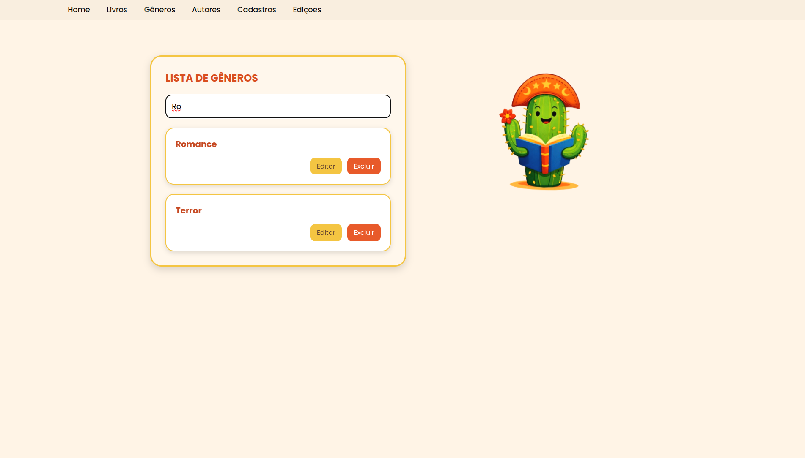
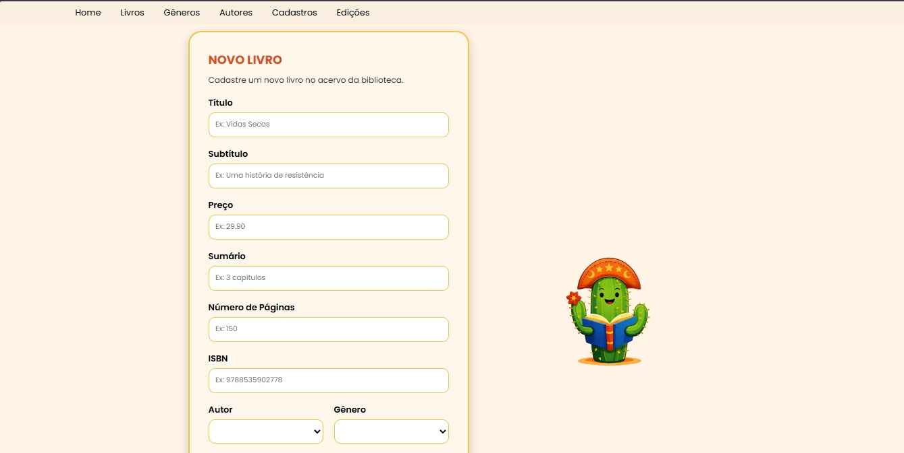
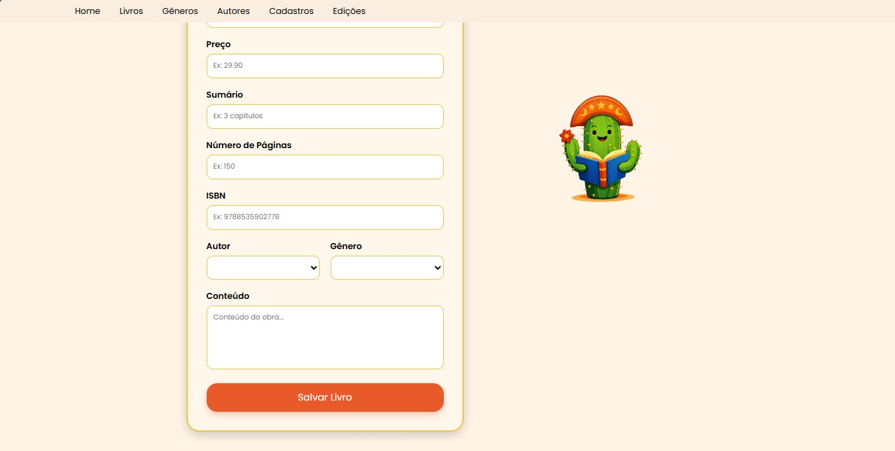

# Raízes do Saber
## Como rodar o frontend
### Pré-requisitos - Antes de começar, você precisa ter instalado na sua máquina:
- Node.js (https://nodejs.org/)
- npm (já vem junto com o Node)
- Git
### Para conferir se já tem tudo instalado rode:
```bash
node -v
npm -v
git --version
``` 
### Depois de conferir:
1. Clone o repositório com o comando: `git clone https://github.com/livialop/rootsOfKnowledge.git`
2. Entre na pasta do projeto: `cd [caminhoDoDiretorio]/rootsOfKnowledge/frontend/`
> [!NOTE]
> Substitua o `[caminhoDoDiretorio]` com o caminho para o diretório onde você clonou o repositório.
3. Instale as dependências com o comando: `npm install`
    - Se precisar, utilize também `npm fund`
4. Rode o frontend com: `npm run dev`

Vai aparecer no terminal algo como: 
```bash
VITE v7.3.1 ready in (...) ms

-> Local: http://localhost:5173/
[...]
```

## Como rodar o backend
### Requisitos:
Ter disponível na máquina:
- IntelliJ
- Java 25 (Recomendação: Java Temurin -> https://adoptium.net/pt-BR/temurin/releases)

### Passo a passo:
- Após clonar o projeto (conforme explicado na parte de como rodar o frontend), abra o IntelliJ e abra o projeto do backend.
- Configure o IntelliJ para utilizar o Java 25 e aguarde a finalização da instalação das dependências do projeto.
- Após isso, clique no botão executável para rodar a aplicação, que ficará localizada na porta 8080.
Vai aparecer algo como: 
```bash
:: Spring Boot :: (v4.0.1)
[...]
Completed Initialization in (...) ms
```
- Caso se interesse, acesse a URL http://localhost:8080/swagger-ui/index.html para testar os endpoints da API.

Depois de rodar o backend e o frontend, a aplicação poderá ser acessada no endereço http://127.0.0.1:5173. 

## Endpoints da API
| Método do endpoint  | Rota | Detalhe |
|         -         |   -  |    -    | 
| GET | `/autores` | Rota para retornar todos os autores cadastrados.  |
| GET | `/autor/{id}`| Rota para pegar os detalhes de um autor específico. |
| PUT | `/autor/{id}` | Rota para editar os detalhes de um autor específico. | 
| DELETE | `/autor/{id}` | Rota para deletar um autor específico do banco. |
| POST | `/novoautor` | Rota para adicionar um novo autor ao banco. |
| GET | `/generos` | Rota para retornar todos os gêneros cadastrados.  |
| PUT | `/genero/{id}` | Rota para editar os detalhes de um gênero específico. | 
| DELETE | `/genero/{id}` | Rota para deletar um gênero específico do banco. |
| POST | `/novogenero` | Rota para adicionar um novo gênero ao banco. |
| GET | `/livros` | Rota para retornar todos os livros cadastrados.  |
| GET | `/livro/{id}` | Rota para retornar todos os detalhes de um livro específico.  |
| PUT | `/livro/{id}` | Rota para editar os detalhes de um livro específico. | 
| DELETE | `/livro/{id}` | Rota para deletar um livro específico do banco. |
| POST | `/novolivro` | Rota para adicionar um novo livro ao banco. |

## Funcionalidades do sistema
A aplicação "Raízes do Saber" conta com filtro de nome para gêneros, livros e autores. Basta entrar na página de interesse e utilizar o sistema de filtro para encontrar o que procura:




### Página de novo livro



### Página Home


### Busca na navbar da página Home
